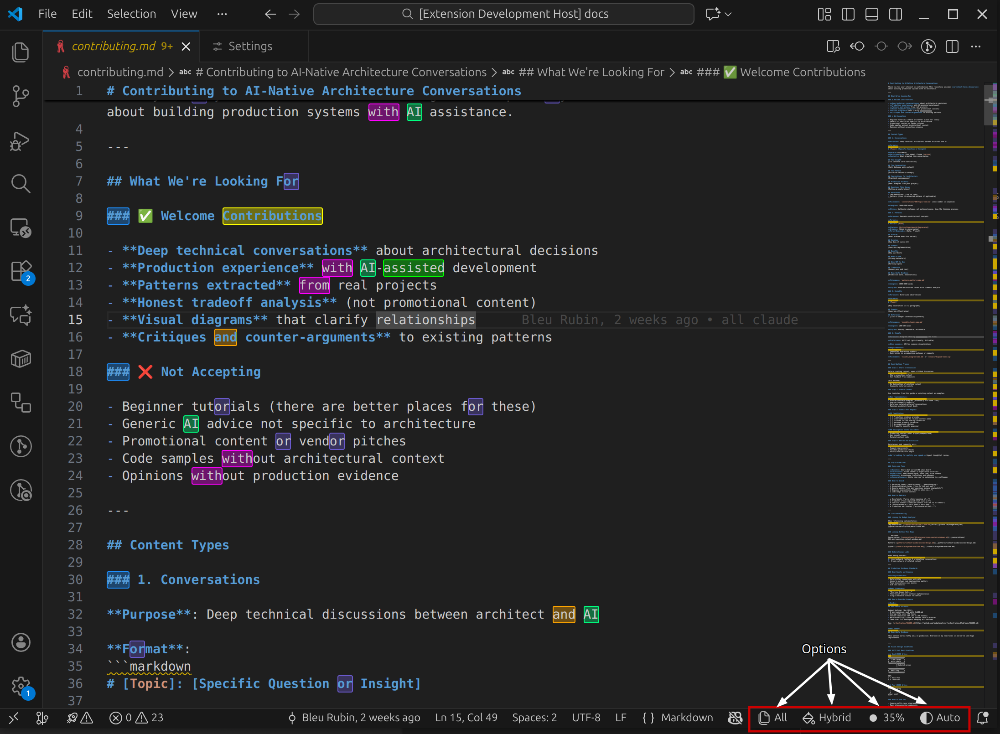

# Multi-Scope Highlighter

**A focus-assist highlighting tool for VS Code. Highlight multiple words with distinct colors, manage scopes across files, and toggle between visual styles and levels of opacity.**

## ✨ Features

### Multi-Word Highlighting

**Highlight multiple different words simultaneously. Each new word gets a unique, high-contrast color automatically.**

- **Smart Coloring:** Colors are automatically selected from a palette of 20 distinct, high-visibility hues.
- **Adaptive Themes:** Colors automatically adjust to look great in both Dark (Neon/Pastel) and Light (Deep/Contrast) themes.

### Dual Scopes

**Control where your highlights appear using the Status Bar switcher:**

- **Single File:** Highlights only appear in the active editor.
- **All Open Files:** Highlights automatically propagate to all visible editors (split panes, grid layouts).

### Dual Styles

**Toggle between two visual modes to suit your preference:**

- **Fill:** Solid background color (clean, low noise).

- **Box:** 2px Outline border with transparent background (minimalist).

### ⚙️ Advanced Management

**Use the "Manage Highlights" command to fine-tune your setup without restarting:**

- **In-Place Editing:** Rename highlighted patterns instantly.
- **Mode Cycling:** Toggle a highlight between Plain Text, Whole Word `\b`, and Regex `.*` modes with a single click.
- **Color Picker:** Manually reassign colors, with a smart filter that hides colors already in use.

### Profile Persistence

**Stop re-highlighting the same logs every day.**

- **Save Profile:** Save your current set of highlights to a named JSON file in your workspace.
- **Load Profile:** Instantly restore a debugging context.

## 🛠️ Configuration

You can customize the visual appearance of highlights in your VS Code Settings (`Ctrl+,`) OR directly from the Status Bar:

| Setting | Description | Default |
| :--- | :--- | :--- |
| **Fill Opacity** | Adjusts the transparency of the background color (0.1 - 1.0). Lower this value if the highlights are too bright. | `0.35` |
| **Hybrid Mode** | If enabled, the "Fill" style also draws a thin border around the highlight for better definition. | `true` |
| **Text Contrast** | Controls how text inside a highlight appears: • `inherit`: Preserves syntax highlighting (keywords, strings, etc). • `force-contrast`: Forces text to Black/White for maximum readability. | `inherit` |

## 🚀 Usage

### Basic Commands

| Command | Keybinding | Description |
| :--- | :--- | :--- |
| **Toggle Highlight** | `Ctrl+H` / `Cmd+H` | Highlights the selected word. If already highlighted, removes it. |
| **Manage Highlights** | *(via Palette)* | Opens the interactive manager to edit text, change colors, or cycle modes. |
| **Clear All** | *(via Palette)* | Removes all highlights immediately. |

### Status Bar Controls

**Look for the indicators in the bottom right of your VS Code window:**

- **$(files) Single / All:** Switch scope.
- **$(paintcan) Fill / Hybrid / Box:** Cycle visual style.
- **$(circle-filled) 35%:** Set highlight opacity (opens picker).
- **$(color-mode) Auto / B&W:** Toggle high-contrast text mode.

### The "Manage Highlights" Workflow

**Run the command `Highlight: Manage Current Highlights` to see a list of active patterns.**

- **Click a Row:** Opens the Color Picker for that specific word.
- **✏️ (Pencil):** Edit the text pattern (e.g., fix a typo).
- **[abc] / [ab] / [.*] (Mode):** Click this icon to cycle the matching mode:
  - **[abc] Text:** Simple literal match.
  - **[ab] Whole Word:** Matches `\bword\b` only.
  - **[.*] Regex:** Treats the text as a Regular Expression.

## ⌨️ Extension Commands

**You can access these via the Command Palette (`Ctrl+Shift+P` / `Cmd+Shift+P`):**

- `Highlight: Toggle Selection`
- `Highlight: Manage Current Highlights`
- `Highlight: Clear All`
- `Highlight: Toggle Scope (Single/All Open)`
- `Highlight: Toggle Style (Box/Fill/Hybrid)`
- `Highlight: Set Opacity`
- `Highlight: Toggle Text Contrast`
- `Highlight: Save Profile`
- `Highlight: Load Profile`
- `Highlight: Delete Profile`

## 🔒 Storage & Privacy

- **Profiles:** Saved as JSON files in a `.vscode/highlights/` directory within your current workspace. This makes it easy to share highlight profiles with your team by committing them to version control.
- **Runtime:** Highlights are temporary and exist only in memory unless explicitly saved to a profile.
