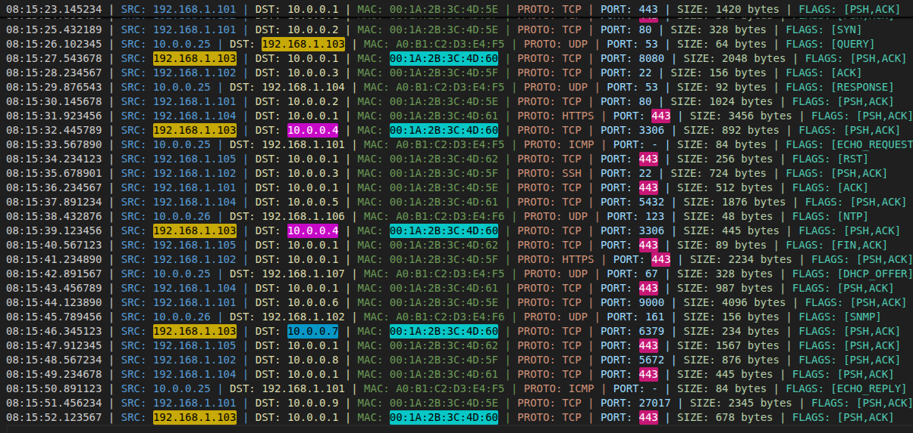
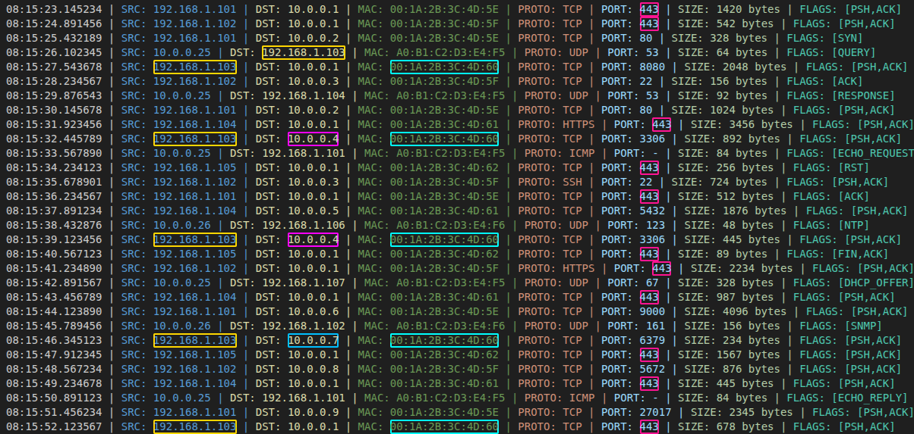
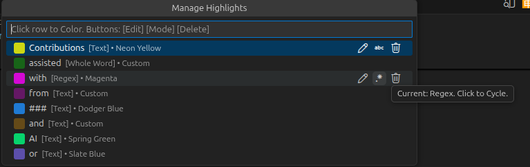
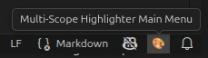
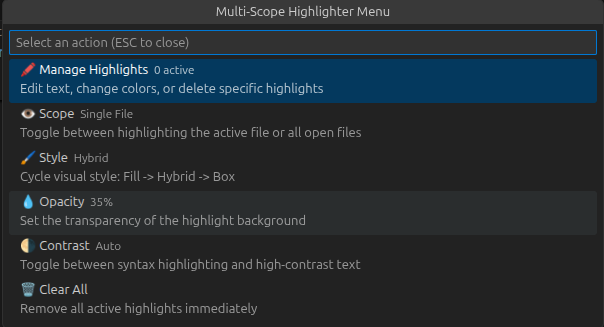
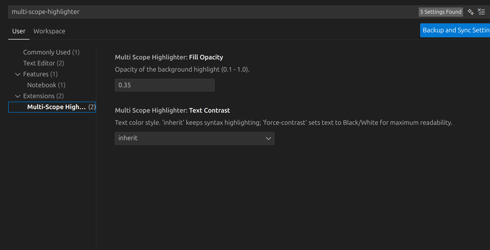
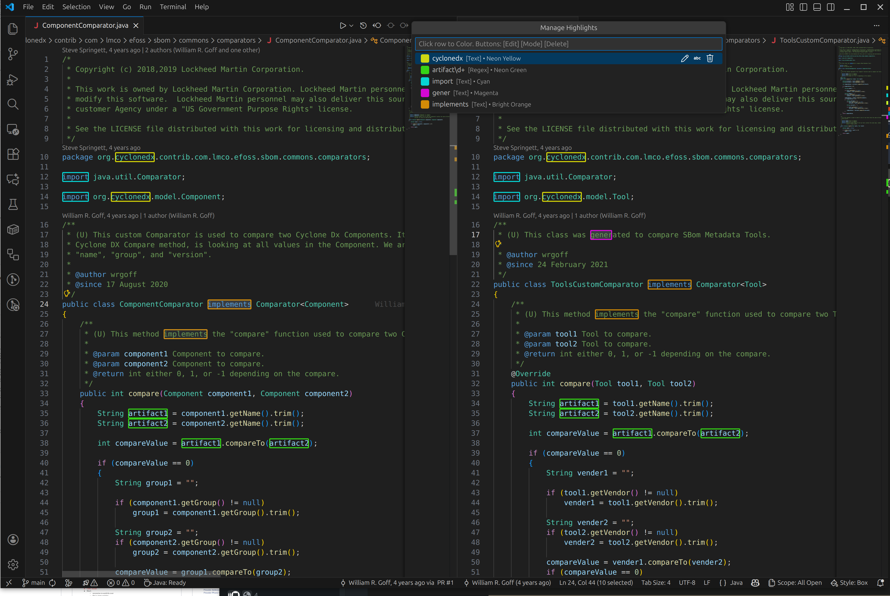

# Multi-Scope Highlighter

**A focus-assist highlighting tool for VS Code. Highlight multiple words with distinct colors, manage scopes across files, and toggle between visual styles and levels of opacity.**

## ✨ Features

### Multi-Word & File Highlighting

**Highlight multiple different words simultaneously. Each new word gets a unique, high-contrast color automatically.**

- **Smart Coloring:** Colors are automatically selected from a palette of 20 distinct, high-visibility hues.
- **Adaptive Themes:** Colors automatically adjust to look great in both Dark (Neon/Pastel) and Light (Deep/Contrast) themes.
- **Gutter markers:** Matching elements shown in gutter markers of the same color.

### Multi Scopes

**Control where your highlights appear using the Status Bar switcher:**

- **Single File:** Highlights only appear in the active editor.
- **All Open Files:** Highlights automatically propagate to all visible editors (split panes, grid layouts).

### Multiple Styles

**Toggle between two visual modes to suit your preference:**

- **Fill:** Solid background color (clean, low noise).

- **Box:** 2px Outline border with transparent background (minimalist).

### ⚙️ Advanced Management

**Use the "Manage Highlights" command to fine-tune your setup without restarting:**

- **In-Place Editing:** Rename highlighted patterns instantly.
    - **Toggle between:**
        - **Plain text**
        - **Whole words**
        - **Regular expressions**
- **Mode Cycling:** Toggle a highlight between Plain Text, Whole Word `\b`, and Regex `.*` modes with a single click.
- **Color Picker:** Manually reassign colors, with a smart filter that hides colors already in use.

### Profile Persistence

**Stop re-highlighting the same logs every day.**

- **Save Profile:** Save your current set of highlights to a named JSON file in your workspace.
- **Load Profile:** Instantly restore a debugging context.

## 🛠️ Configuration

- **Customize the visual appearance of highlights directly from the Status Bar.**

- **All controlled from a single widget**

- **Dedicated 2nd level menu**

| Setting | Description | Default |
| :--- | :--- | :--- |
| **Fill Opacity** | Adjusts the transparency of the background color (0.1 - 1.0). Lower this value if the highlights are too bright. | `0.35` |
| **Hybrid Mode** | If enabled, the "Fill" style also draws a thin border around the highlight for better definition. | `true` |
| **Text Contrast** | Controls how text inside a highlight appears: • `inherit`: Preserves syntax highlighting (keywords, strings, etc). • `force-contrast`: Forces text to Black/White for maximum readability. | `inherit` |

## 🚀 Usage

### Adding & Removing Highlights

**Quick Reference:**

| Action | Keybinding | Description |
| :--- | :--- | :--- |
| **Toggle Single** | `Alt+Q` / `Option+Q` | • With text selected: adds/removes that exact text • Cursor in word (no selection): adds/removes that word • Cursor in existing highlight: removes it |
| **Toggle Multiple** | `Shift+Alt+Q` / `Shift+Option+Q` | • Selection with highlights: removes ALL highlights within selection • Selection without highlights: adds all words in selection • Cursor in word (no selection): adds that word |

| Action | Keybinding | Description |
| :--- | :--- | :--- |
| **Undo** | `Ctrl+Alt+Z` / `Cmd+Option+Z` | Undo the last highlight change (up to 50 actions) |
| **Redo** | `Ctrl+Alt+Y` / `Cmd+Option+Y` | Redo a previously undone highlight change |
| **Context Menu** | Right-click | • With selection: "Toggle Selection" • Without selection: "Manage Highlights" |
| **Clear All** | Via Palette | Removes all highlights at once |

**Tip:** All keybindings are customizable via VS Code's Keyboard Shortcuts editor.

**Smart Delimiter Stripping:**

When adding highlights from selections, unmatched delimiter pairs are automatically removed to ensure clean pattern matching:

- **Supported pairs:** `()` `[]` `{}` `""` `''` ` `` `` `**` `~~` `__` `..`
- **Multi-character support:** Handles consecutive delimiters like `**bold**`, `[[link]]`, `...ellipsis...`
- **Auto-balance:** If selection is `"Service..."` but full text is `"...Service..."`, the trailing `...` is stripped to give `Service`
- **Whitespace trimmed:** Leading/trailing spaces are removed before processing

Example: Selecting `**word**` highlights as `word`, but selecting `**word` highlights as `word` (unmatched `**` removed).

**Column/Block Selection Support:**

Both keybindings (`Alt+Q` and `Shift+Alt+Q`) fully support **column selection mode**:

- **Multiple selections:** All selected text blocks are processed simultaneously
- **Deduplication:** Unique words across all selections are highlighted automatically
- **Remove mode:** If any selection overlaps existing highlights, those highlights are removed

**Noise Character Filtering:**

When using `Shift+Alt+Q` to highlight multiple words from a selection, common punctuation and symbols are automatically filtered out:

- **Default exclusions:** `-`, `=`, `:`, `,`, `;`, `.`, `!`, `?`, `|`, `&`, `+`, `*`, `/`, `\`, brackets, quotes, and more
- **Customizable:** Edit the `multiScopeHighlighter.excludeNoiseWords` setting to add or remove items from the filter list
- **Feedback:** The status message shows how many noise words were filtered (e.g., "Highlighted 5 word(s) (filtered 3 noise)")

### Status Bar Controls

**Look for the indicators in the bottom right of your VS Code window:**

- **$(files) Single / All:** Switch scope.
- **$(paintcan) Fill / Hybrid / Box:** Cycle visual style.
- **$(circle-filled) 35%:** Set highlight opacity (opens picker).
- **$(color-mode) Auto / B&W:** Toggle high-contrast text mode.

### The "Manage Highlights" Workflow

**Run the command `Highlight: Manage Current Highlights` to see a list of active patterns.**

- **Click a Row:** Opens the Color Picker for that specific word.
- **✏️ (Pencil):** Edit the text pattern (e.g., fix a typo).
- **[abc] / [ab] / [.*] (Mode):** Click this icon to cycle the matching mode:
  - **[abc] Text:** Simple literal match.
  - **[ab] Whole Word:** Matches `\bword\b` only.
  - **[.*] Regex:** Treats the text as a Regular Expression.

## ⌨️ Extension Commands

**You can access these via the Command Palette (`Ctrl+Shift+P` / `Cmd+Shift+P`):**

- `Highlight: Open Menu`
- `Highlight: Toggle Selection`
- `Highlight: Add Word(s) at Cursor or from Selection`
- `Highlight: Manage Current Highlights`
- `Highlight: Clear All`
- `Highlight: Undo Last Change` - Undo highlight operations (Ctrl+Alt+Z / Cmd+Option+Z)
- `Highlight: Redo Last Change` - Redo highlight operations (Ctrl+Alt+Y / Cmd+Option+Y)
- `Highlight: Toggle Scope (Single/All Open)`
- `Highlight: Toggle Style (Box/Fill/Hybrid)`
- `Highlight: Set Opacity`
- `Highlight: Toggle Text Contrast`
- `Highlight: Save Profile`
- `Highlight: Load Profile`
- `Highlight: Delete Profile`

## 🔒 Storage & Privacy

- **Profiles:** Saved as JSON files in a `.vscode/highlights/` directory within your current workspace. This makes it easy to share highlight profiles with your team by committing them to version control.
- **Runtime:** Highlights are temporary and exist only in memory unless explicitly saved to a profile.
